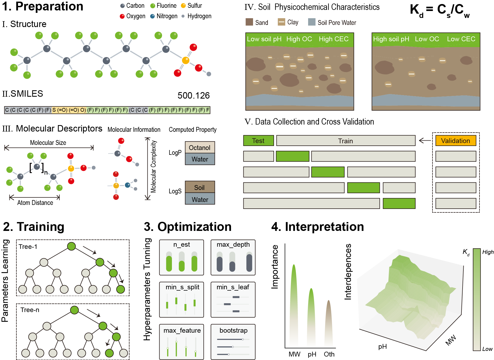

# **Elucidating Per- and Polyfluoroalkyl Substances (PFASs) Soil-Water Partitioning Behavior through Explainable Machine  Learning Models**

[](https://doi.org/10.1016/j.scitotenv.2024.176575)

<p align="left">


</p>

This repository provides the code for machine learning models predicting the partitioning coefficient of PFASs and all associated raw datasets.

Four descriptor-based models  (i.e., [gradient boosting regression tree](https://scikit-learn.org/stable/modules/generated/sklearn.ensemble.GradientBoostingRegressor.html) (GBRT), [random forest](https://scikit-learn.org/stable/modules/generated/sklearn.ensemble.RandomForestRegressor.html) (RF), and[ k-nearest neighbor](https://scikit-learn.org/stable/modules/generated/sklearn.neighbors.KNeighborsRegressor.html) (KNN), [multiple linear regression](https://scikit-learn.org/stable/modules/generated/sklearn.linear_model.LinearRegression.html) (MLR)) were selected to compare the predictive performance of different training methods. **Ultimately, the [RF]() model performed best** across five random splits of the dataset.

The figures folder contains the results of all the interpretive methods. Detailed information about the compounds can be found in the manuscript.



---

## 🌟 Table of Contents

- [✈ Install &amp; Setup]()
- [💡 Quick start]()
- [⚙️ Model interpretation]()
- 📋 [Collaboration and Citations]()

## 🔧 Install & Setup

1. Clone the [PFAS_Kd_Prediction](https://github.com/Jarexing/PFAS_Kd_Prediction) repository:

   ```sh
   git clone : //github.com/Jarexing/PFAS_Kd_Prediction
   ```
2. Please ensure you have the following dependencies installed on your system:

- **Base Environment**: python3.8
- **Packages**:
  ```py
  scikit-learn: 1.5.1
  hyperopt: 0.2.7
  seaborn: 0.13.2
  matplotlib: 3.8.4
  shap: 0.46.0
  ```

## ✈ Quick Start

| Function                                                                                                                             | Description                                                                                                                                                                                                                                                                                                                  |
| :----------------------------------------------------------------------------------------------------------------------------------- | :--------------------------------------------------------------------------------------------------------------------------------------------------------------------------------------------------------------------------------------------------------------------------------------------------------------------------- |
| [Data Procesing.ipynb](https://github.com/WestonSu/Antimicrobials/blob/main/1_GAT/code/Antibacterials.ipynb)                            | Preprocesse dataset by removing low-variance and highly correlated features, normalizing the data, and removing outliers. Random Forest model was used to identify the most important features.                                                                                                                              |
| [Model Training and Optimization.ipynb](https://github.com/WestonSu/Antimicrobials/blob/main/1_GAT/code/AttentiveFP/AttentiveLayers.py) | Data preprocessing, model optimization, and visualization. Remove outliers and visualize data distribution. Models are optimized using hyperparameter tuning, evaluated using different metrics. The results are visualized through residual analysis and performance comparisons.                                           |
| [Model Interpretation.ipynb](https://github.com/WestonSu/Antimicrobials/blob/main/1_GAT/code/AttentiveFP/AttentiveLayers.py)            | Evaluate feature importance using permutation importance, SHAP values, and partial dependence plots (PDPs). Generates individual conditional expectation (ICE) curves and 3D interaction plots for feature interactions. Key steps include standardizing the data, calculating feature importance, visualizing the results. |
| [Model Saving and Application.ipynb](https://github.com/WestonSu/Antimicrobials/blob/main/1_GAT/code/AttentiveFP/AttentiveLayers.py)    | Save model as a `.pkl` file. Calculate Tanimoto similarity between molecules and save the results.                                                                                                                                                                                                                         |

`Hyperopt` is a Python library for hyperparameter optimization using methods like Tree-structured Parzen Estimators (TPE) and random search. It efficiently explores complex parameter spaces and scales well with large datasets, making it a popular choice for tuning machine learning models.

A `.pkl` file is a serialized file created using Python's `pickle` module, which stores objects in binary format. In the context of machine learning, a `.pkl` file typically contains a trained model, including its parameters, learned weights, and configuration, allowing it to be easily saved and reloaded without retraining.

## ⚙️ Model Interpretation

We integrated a suite of interpretive analytical tools, including [permutation feature importance](https://scikit-learn.org/stable/modules/permutation_importance.html) (PFI), [shapley additive explanations](https://github.com/shap/shap) (SHAP), [partial dependence plots](https://scikit-learn.org/stable/modules/partial_dependence.html) (PDP), [individual conditional expectation](https://scikit-learn.org/stable/modules/partial_dependence.html) (ICE), and **3D interactive visualization**. These methods are crucial for uncovering the interdependencies between soil and PFAS physicochemical attributes. Furthermore, the easily accessible input features used in these models allow for the rapid estimation of Kd values for PFAS in various soils..

---

## 📋 Collaboration and Citations

Due to the limitations of the [**training set (n=2,148)**](), certain PFAS outside its applicability domain may not have ideal predictions for partitioning behavior. We welcome contributions from other researchers to supplement data on the distribution behavior, especially for newer PFAS and less common soil types, to validate and further refine the model.

We ask users to directly cite the following paper:

J. Xie et al. Elucidating Per- and Polyfluoroalkyl Substances (PFASs) Soil-Water Partitioning Behavior through Explainable Machine Learning Models. Science of The Total Environment **2024** **954**, 176575.

This project also builds on a number of other projects, algorithms and ideas. Please consider citing the following full list of papers when relevant:

1. Lei, X. et al. Development, Evaluation, and Application of Machine Learning Models for Accurate Prediction of Root Uptake of Per- and Polyfluoroalkyl Substances. Environmental Science & Technology **2023** **57** (46), 18317-18328.
2. Yang, C. et al. New insights on the formation of nucleation mode particles in a coastal city based on a machine learning approach. Environmental Science & Technology **2024** *58* (2), 1187-1198.
3. Gao, F. et al. Direct prediction of bioaccumulation of organic contaminants in plant roots from soils with machine learning models based on molecular structures. Environmental Science & Technology **2021** *55* (24), 16358-16368.
4. Tengyi, Z. et al. Contribution of molecular structures and quantum chemistry technique to root concentration factor: An innovative application of interpretable machine learning. Journal of Hazardous Materials, Volume 459, **2023,** 132320.
5. Raquel R. et al. Interpretation of Compound Activity Predictions from Complex Machine Learning Models Using Local Approximations and Shapley Values. Journal of Medicinal Chemistry **2020** *63* (16), 8761-8777
